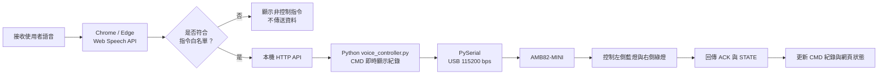

# Ameba Mini 語音控制 LED

本專案透過瀏覽器辨識語音，將符合白名單的控制指令交給 Python，再經由 USB 序列埠控制 AMB82-MINI 的板載 LED。

執行時，Python 會在 CMD 視窗即時顯示辨識文字、送出的指令、板卡回傳的 `ACK`、`STATE` 及錯誤訊息。網頁上的 LED 狀態則依據板卡回覆更新，方便確認指令是否成功執行。

## 硬體與通訊設定

- 開發板：Realtek AmebaPro2 AMB82-MINI（RTL8735B）
- 藍色板載 LED：`LED_B`，Arduino 腳位 D23
- 綠色板載 LED：`LED_G`，Arduino 腳位 D24
- LED 控制方式：`HIGH` 為亮，`LOW` 為滅
- 序列埠傳輸速率：115200 bps

上述腳位已依本機安裝的 `realtek:AmebaPro2 4.1.1-build20260915` 板卡定義與官方範例核對。正式繳交前，仍需使用實體板卡確認燈號是否正常運作。

## 系統運作流程

瀏覽器取得語音辨識結果後，會先檢查文字是否符合指令白名單。只有符合的指令才會送至本機 Python 程式，並轉送給板卡執行；其他語句僅顯示在網頁上，不會觸發 LED 控制。



## 支援的語音指令

| 中文語音 | 序列指令 | 執行動作 |
|---|---|---|
| 左邊開燈 | `LEFT_ON` | 開啟藍燈 |
| 左邊關燈 | `LEFT_OFF` | 關閉藍燈 |
| 右邊開燈 | `RIGHT_ON` | 開啟綠燈 |
| 右邊關燈 | `RIGHT_OFF` | 關閉綠燈 |
| 全部開燈 | `ALL_ON` | 同時開啟兩顆 LED |
| 全部關燈 | `ALL_OFF` | 同時關閉兩顆 LED |
| 閃爍三次 | `BLINK_3` | 兩顆 LED 閃爍三次，再恢復原本狀態 |

英文模式可使用以下短指令：

- 藍燈：`Blue on`、`Blue off`
- 綠燈：`Green on`、`Green off`
- 全部燈號：`Lights on`、`Lights off`
- 閃爍三次：`Blink now`

系統也保留舊版指令的相容性，包括 `left/right light on/off` 與 `Blink three`。

### 語音回覆

網頁預設啟用「語音回覆」。收到板卡確認成功的 `ACK` 後，Python 會透過 Windows 內建語音功能，由電腦喇叭播報執行結果。

播報期間，系統會暫停語音辨識，結束後再自動恢復，避免將自己的播報內容誤認為新的控制指令。

## 使用步驟

### 1. 上傳板卡程式

在 Arduino IDE 中，選擇：

`AmebaPro2 ARM (32-bits) Boards > AMB82-MINI`

開啟 [VoiceLedController.ino](firmware/VoiceLedController/VoiceLedController.ino)，完成編譯與上傳。

上傳後，按一下板上的 RESET 按鈕，並關閉 Arduino 序列監控視窗，讓 Python 可以使用 COM 埠。

### 2. 安裝 Python 套件

第一次使用時，請在專案根目錄開啟 CMD，執行：

```powershell
python -m pip install -r requirements.txt
```

### 3. 啟動控制程式

雙擊專案根目錄的 `start_voice_controller.cmd`。

程式會啟動 Python、嘗試連接 COM3，並在 CMD 視窗持續顯示辨識結果、傳送指令、板卡回覆及錯誤訊息。使用期間請保持該視窗開啟。

也可以手動執行：

```powershell
python -u voice_controller.py --serial-port COM3 --web-port 8000
```

若板卡使用的序列埠不是 COM3，請將指令中的 `COM3` 改成實際的埠號。

### 4. 開啟網頁並開始辨識

使用最新版 Chrome 或 Edge 開啟：

[http://localhost:8000/webui/](http://localhost:8000/webui/)

首次使用時，請允許瀏覽器存取麥克風。

當畫面顯示「COM3 已由 Python 連接」後，按下「開始語音辨識」即可操作。若尚未連線，可按「連接 AMB82-MINI」，讓 Python 再次嘗試連接。

若瀏覽器無法使用語音辨識，也可以透過網頁上的測試按鈕，檢查 Python、序列通訊及 LED 控制是否正常。

### 使用注意事項

COM3 應由 Python 控制程式單獨使用。啟動前，請先關閉 Arduino IDE 的序列監控視窗及其他串口工具，避免序列埠被占用。

關閉 CMD 視窗後，Python 與網頁伺服器會停止執行，COM3 也會釋放；LED 則不會因為程式關閉而主動改變狀態。

## 異常狀況處理

| 狀況 | 系統處理方式 |
|---|---|
| 辨識文字不符合白名單 | 網頁顯示「非控制指令」，不傳送控制資料 |
| 板卡未連接或序列通訊中斷 | 網頁顯示通訊失敗，不將燈號顯示為執行成功 |
| 板卡收到未知指令 | 回傳 `ERR UNKNOWN_COMMAND`，維持原本 LED 狀態 |
| 指令送出後 4 秒內未收到 `ACK` | CMD 與網頁顯示逾時訊息 |
| COM3 被其他程式占用 | Python 顯示連接錯誤，不將連線標示為成功 |

網頁上的藍燈與綠燈狀態，僅依板卡回傳的 `STATE` 更新。

## 實機驗收

請使用 [acceptance-test.csv](docs/acceptance-test.csv) 記錄以下測試：

- 「左邊開燈」五次
- 「右邊開燈」五次
- 非控制語句一次
- 通訊中斷一次

測試結果應以實際操作為準。尚未連接實體板卡或完成測試的項目，請勿填寫為成功。

## 自動化測試

在專案根目錄執行：

```powershell
python -m unittest tests.test_voice_controller -v
node --test tests/command-parser.test.mjs
```

測試範圍包含：

- Python 對 `ACK/STATE` 通訊協定的處理
- 未知指令的拒絕機制
- 瀏覽器辨識文字的正規化
- 語音文字與控制指令的映射

LED 實際亮滅、序列埠中斷及麥克風語音辨識，仍需搭配實體設備驗證。
